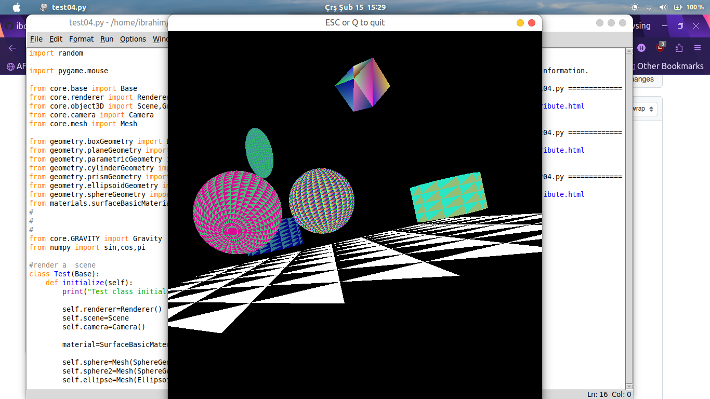
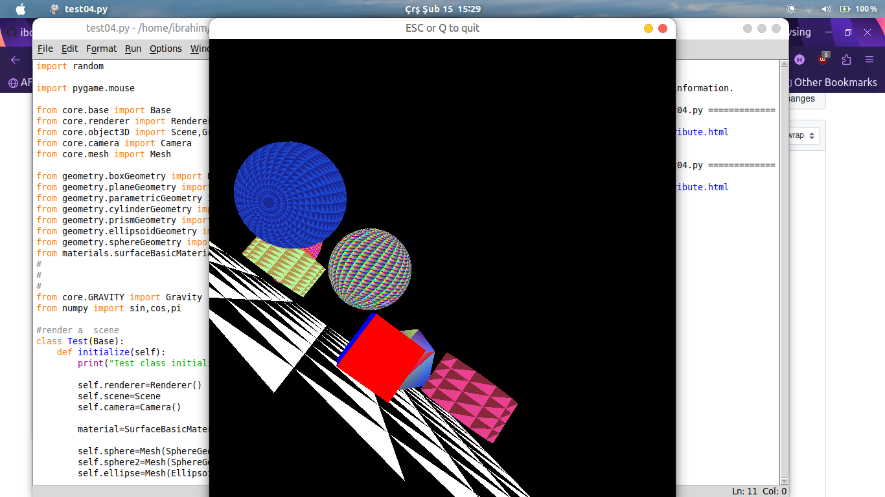

# Cube
## Computer Graphics sample animations by using openGL libraries.
Environment: | python3 | Ubuntu 22|
--- | --- | --- |
- Updated with object-oriented design and pyOpenGL library implementations. Added more geometric objects, simple gravity etc.
- Install required libraries: __`pip install pyopengl pygame numpy`__
- User can move camera by using __w,a,s,d__ keys and __mouse__ to interact with screen.

New preview images

Old preview

