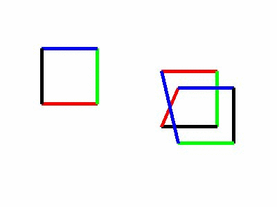

# Cube
Computer Graphics sample animations by using openGL libraries.
- Updated with object-oriented design and pyOpenGL library implementations. Added more geometric objects.

-new preview images

- old preview

